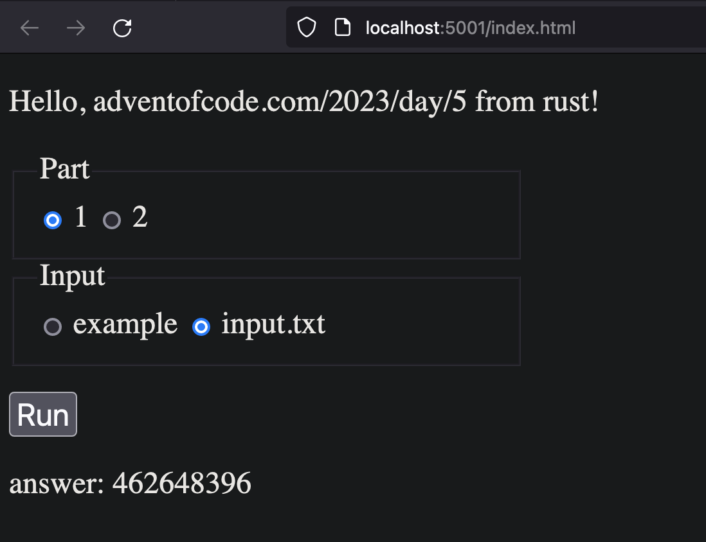

# day5

Solved in rust, also available as website.
wasm sources:
- https://github.com/rustwasm/wasm-bindgen/tree/main/examples/without-a-bundler
- https://rustwasm.github.io/docs/wasm-bindgen/examples/hello-world.html#hello-world

## CLI
to run:
```bash
cargo build && time target/release/day5 [1|2]
```

to develop:
```bash
cargo watch -x "run --release [1|2]"
```

## Browser
install:
```
cargo install wasm-pack dufs
```

build:
```bash
wasm-pack build --target web
cargo watch -x "wasm-pack build --target web"
dufs -p 5001
```
http://localhost:5001/index.html


## Output
### Browser


### CLI
#### Part 1
```
Hello, adventofcode.com/2023/day/5 from rust!
seeds: 3139431799 50198205 3647185634 110151761 2478641666 139825503 498892555 8913570 961540761 489996751 568452082 100080382 907727477 42158689 1617552130 312026427 342640189 97088268 2049289560 336766062

seed-to-soil map:
1615836342 1401909974 23067952
--- Part One ---
seeds: [3139431799, 50198205, 3647185634, 110151761, 2478641666, 139825503, 498892555, 8913570, 961540761, 489996751, 568452082, 100080382, 907727477, 42158689, 1617552130, 312026427, 342640189, 97088268, 2049289560, 336766062]
min_destination: 462648396
target/release/day5 1  0.00s user 0.00s system 72% cpu 0.002 total
```

#### Part 2
```
Hello, adventofcode.com/2023/day/5 from rust!
seeds: 3139431799 50198205 3647185634 110151761 2478641666 139825503 498892555 8913570 961540761 489996751 568452082 100080382 907727477 42158689 1617552130 312026427 342640189 97088268 2049289560 336766062

seed-to-soil map:
1615836342 1401909974 23067952
--- Part Two ---
seeds: [3139431799, 50198205, 3647185634, 110151761, 2478641666, 139825503, 498892555, 8913570, 961540761, 489996751, 568452082, 100080382, 907727477, 42158689, 1617552130, 312026427, 342640189, 97088268, 2049289560, 336766062]
start: 3139431799, length: 50198205, min_destination: 4294967295
start: 3647185634, length: 110151761, min_destination: 1304094873
start: 2478641666, length: 139825503, min_destination: 1304094873
start: 498892555, length: 8913570, min_destination: 861652553
start: 961540761, length: 489996751, min_destination: 861652553
start: 568452082, length: 100080382, min_destination: 2520479
start: 907727477, length: 42158689, min_destination: 2520479
start: 1617552130, length: 312026427, min_destination: 2520479
start: 342640189, length: 97088268, min_destination: 2520479
start: 2049289560, length: 336766062, min_destination: 2520479
min_destination: 2520479
target/release/day5 2  109.29s user 0.02s system 99% cpu 1:49.91 total
```